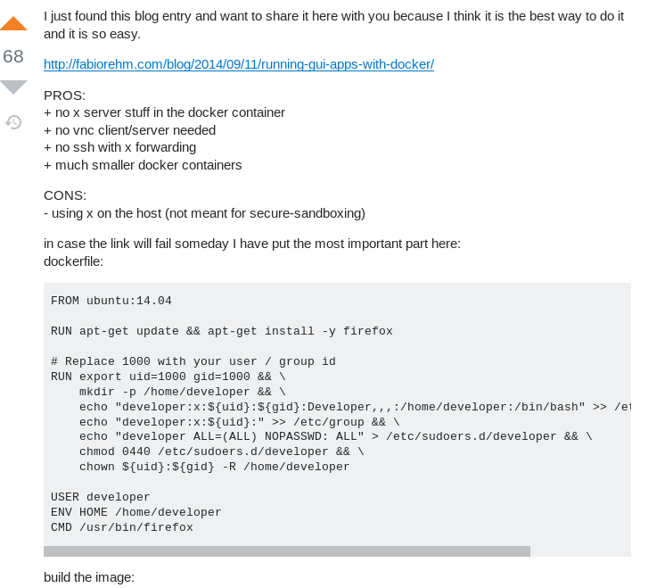
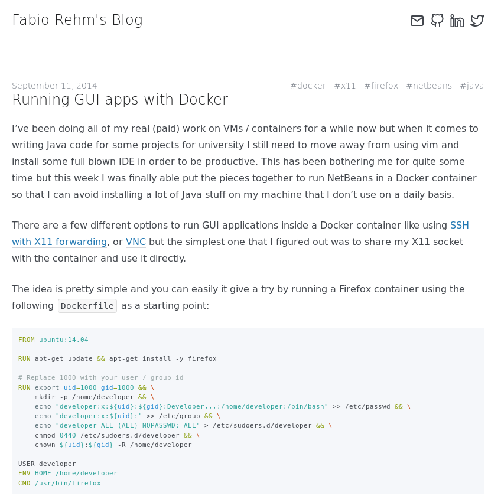
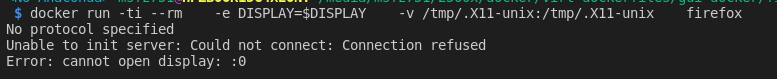
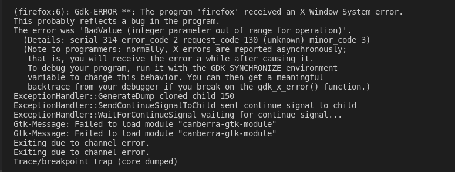

# README

[toc]


Source: https://stackoverflow.com/a/28971413/5270873

Article: http://fabiorehm.com/blog/2014/09/11/running-gui-apps-with-docker/


## Instructions for Ubuntu-14.04

Create a `Dockerfile`:

```
FROM ubuntu:14.04

RUN apt-get update && apt-get install -y firefox

# Replace 1000 with your user / group id
RUN export uid=1000 gid=1000 && \
    mkdir -p /home/developer && \
    echo "developer:x:${uid}:${gid}:Developer,,,:/home/developer:/bin/bash" >> /etc/passwd && \
    echo "developer:x:${uid}:" >> /etc/group && \
    echo "developer ALL=(ALL) NOPASSWD: ALL" > /etc/sudoers.d/developer && \
    chmod 0440 /etc/sudoers.d/developer && \
    chown ${uid}:${gid} -R /home/developer

USER developer
ENV HOME /home/developer
CMD /usr/bin/firefox
```


Build the image:

```
docker build -t firefox .
```

Run with:

```
docker run -ti --rm \
   -e DISPLAY=$DISPLAY \
   -v /tmp/.X11-unix:/tmp/.X11-unix \
   firefox
```


## Original post




## Original article

http://fabiorehm.com/blog/2014/09/11/running-gui-apps-with-docker/



## Notes

### Successful Debian-9 and Firefox

Build with:

```
docker build --rm --file Dockerfile.debian9 -t firefox:debian9 "."
```

Running with:

```
docker run -ti --rm \
		-e DISPLAY \
		-v /tmp/.X11-unix:/tmp/.X11-unix \
		-v $HOME/.Xauthority:/home/developer/.Xauthority \
		--net=host \
		--pid=host \
		--ipc=host \
		firefox:debian9
```

from comments in article: http://disq.us/p/18d8cuj

### Unsuccessful Debian-9 and Firefox

Also attempted to do the same with a container built based on `debian:9` but run with error:



when run with:

```
docker run -ti --rm  \
		-e DISPLAY=$DISPLAY  \
        -v /tmp/.X11-unix:/tmp/.X11-unix \
        firefox:debian9
```

Or this other error:



when run with:

```
docker run -ti --rm \
		-e DISPLAY \
		-v /tmp/.X11-unix:/tmp/.X11-unix \
		-v $HOME/.Xauthority:/home/developer/.Xauthority \
		--net=host \
		firefox:debian9
```

or:

```
docker run -ti --rm \
		-e DISPLAY \
		-v /tmp/.X11-unix:/tmp/.X11-unix \
		--volume=$XAUTHORITY:/home/developer/.Xauthority \
		--net=host \
		firefox:debian9
```


Code for the Dockerfile saved under `Dockerfile.debian9`.


